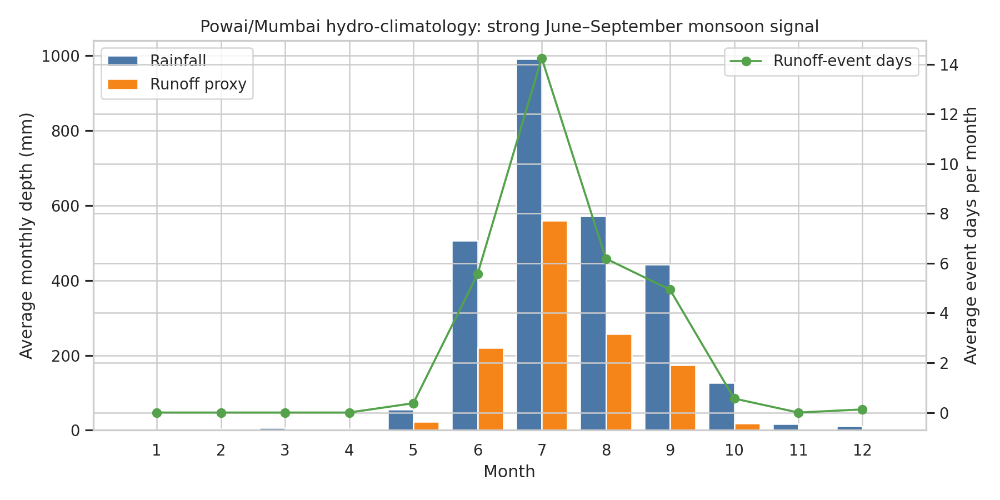
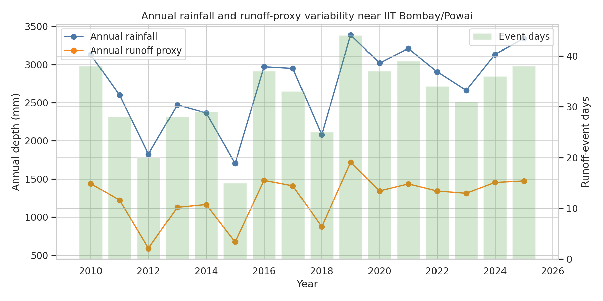
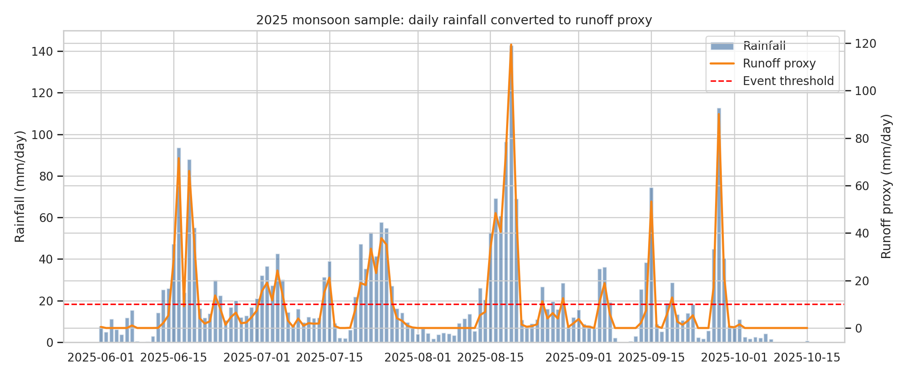
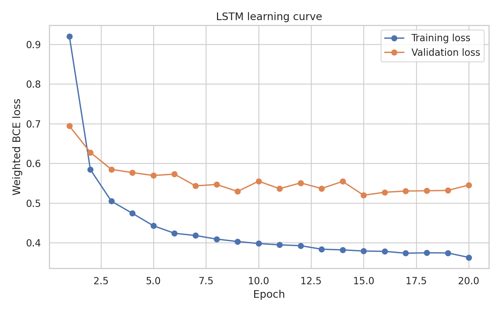
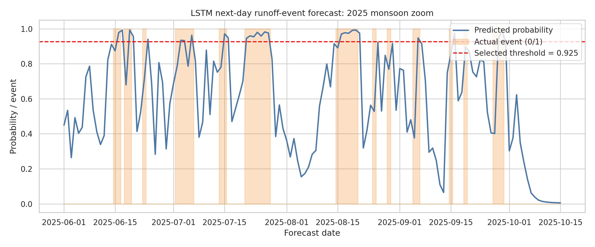
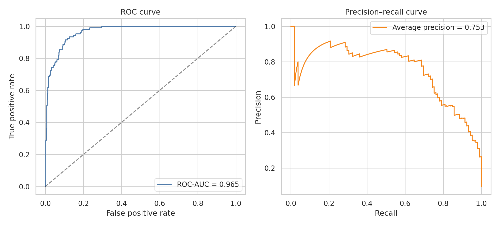
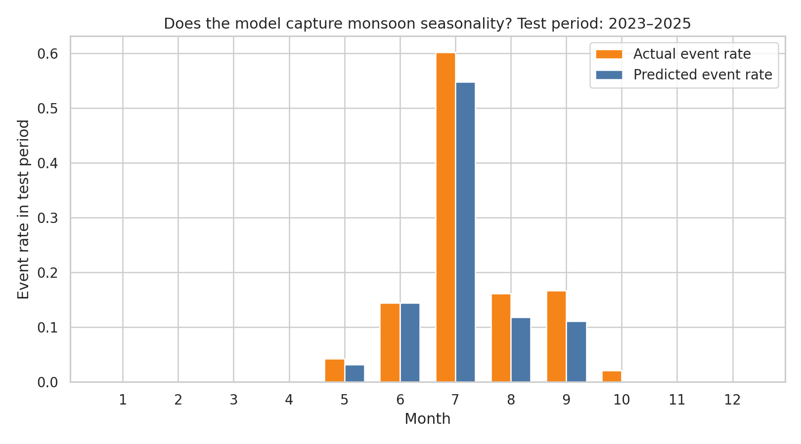

# Hydro-climatology AI/ML Project: Next-day Runoff Event Forecasting near IIT Bombay/Powai

A beginner-friendly self project combining **Python**, **hydrology**, **climatology**, and **AI/ML using an LSTM model**.

**Project idea:** Use daily hydro-climatic variables near IIT Bombay/Powai, Mumbai to forecast whether the next day may have a significant runoff event.

This is suitable for a GitHub repository and resume discussion for **Water Resources Engineering**, **hydro-climatology**, **climate-risk analytics**, **data science**, and **non-core analytics roles**.

---

## 1. Why this project is useful

Urban areas such as Mumbai experience intense monsoon rainfall and drainage stress. In this project, I built a simple AI/ML workflow to answer:

> Can recent rainfall, temperature, humidity, wind speed, seasonality, and a hydrological runoff proxy help predict whether tomorrow will be a runoff-event day?

The project demonstrates:

- Python-based climate data processing
- Hydrological feature engineering
- A basic runoff estimation method using the SCS Curve Number concept
- Time-series sequence modelling using an LSTM
- Model evaluation using ROC-AUC, precision, recall, F1-score, and confusion matrix
- Clear visual results for interpretation

---

## 2. Data source

Daily climate data is downloaded using the **NASA POWER API** for the approximate location of IIT Bombay/Powai, Mumbai.

Approximate coordinates:

- Latitude: `19.13° N`
- Longitude: `72.91° E`

Period used:

- `2010-01-01` to `2025-12-31`

Variables used:

| Variable | Meaning |
|---|---|
| `PRECTOTCORR` | Daily precipitation, mm/day |
| `T2M` | Mean temperature at 2 m, °C |
| `T2M_MAX` | Maximum temperature, °C |
| `T2M_MIN` | Minimum temperature, °C |
| `RH2M` | Relative humidity at 2 m, % |
| `WS2M` | Wind speed at 2 m, m/s |

---

## 3. Hydrology part: runoff-event proxy

Because observed streamflow/discharge data is not directly available in this small self project, the project creates a **runoff proxy** from rainfall using the **SCS Curve Number method**.

The target variable is:

> `1` if tomorrow's runoff proxy is at least `10 mm`, otherwise `0`.

This makes it a binary classification problem:

- `0`: No significant runoff event tomorrow
- `1`: Significant runoff event tomorrow

Important note: This is a **runoff proxy**, not measured river discharge. This should be clearly mentioned in interviews.

---

## 4. AI/ML part: LSTM model

The model uses the previous **30 days** of hydro-climatic features to forecast the next-day runoff-event risk.

Features used in each 30-day sequence:

- Rainfall
- Temperature variables
- Relative humidity
- Wind speed
- Runoff proxy
- 5-day accumulated rainfall
- Seasonal sine/cosine features

The LSTM is implemented using **NumPy only** for educational clarity. This makes the code easier to inspect and explain for beginners because the LSTM gates and backpropagation steps are visible in the Python file.

For larger production projects, the same idea can be implemented using PyTorch or TensorFlow/Keras.

---

## 5. Train-validation-test split

A time-based split is used to avoid data leakage:

| Split | Period |
|---|---|
| Training | 2010-2020 |
| Validation | 2021-2022 |
| Testing | 2023-2025 |

The probability threshold is selected using the validation set by maximizing F1-score.

---

## 6. Results

### Test-period performance: 2023-2025

| Metric | Value |
|---|---:|
| Accuracy | 0.953 |
| Precision | 0.807 |
| Recall | 0.676 |
| F1-score | 0.736 |
| ROC-AUC | 0.965 |
| Average Precision | 0.753 |
| Selected probability threshold | 0.925 |

Confusion matrix on test period:

|  | Predicted no event | Predicted event |
|---|---:|---:|
| Actual no event | 973 | 17 |
| Actual event | 34 | 71 |

Interpretation:

- The model captures the strong monsoon-driven runoff-event pattern.
- Precision is fairly high, meaning many predicted events are correct.
- Recall is moderate, meaning the model still misses some events.
- This is expected because intense rainfall/runoff events are relatively rare compared to normal days.

---

## 7. Plots generated

### Monthly rainfall, runoff proxy, and runoff-event climatology



### Annual rainfall and runoff-proxy variability



### 2025 monsoon daily rainfall converted to runoff proxy



### LSTM training curve



### LSTM predicted probabilities during 2025 monsoon



### ROC and precision-recall curves



### Confusion matrix


### Monthly actual vs predicted event rate



---

## 8. Repository structure

```text
hydro_climate_lstm_mumbai/
│
├── README.md
├── requirements.txt
├── data/
│   ├── nasa_power_powai_2010_2025.csv
│   └── processed_powai_hydroclimate_2010_2025.csv
│
├── src/
│   └── hydro_lstm_project.py
│
└── results/
    ├── 01_monthly_rainfall_runoff_climatology.png
    ├── 02_annual_rainfall_runoff_variability.png
    ├── 03_2025_monsoon_rainfall_to_runoff_proxy.png
    ├── 04_lstm_training_loss.png
    ├── 05_lstm_test_probabilities_2025_monsoon_zoom.png
    ├── 06_lstm_roc_and_precision_recall_curves.png
    ├── 07_lstm_confusion_matrix.png
    ├── 08_monthly_actual_vs_predicted_event_rate.png
    ├── metrics.json
    ├── test_predictions_2023_2025.csv
    └── training_history.csv
```

---

## 9. How to run this project

### Step 1: Clone the repository

```bash
git clone <your-repo-link>
cd hydro_climate_lstm_mumbai
```

### Step 2: Install dependencies

```bash
pip install -r requirements.txt
```

### Step 3: Run the project

```bash
python src/hydro_lstm_project.py
```

The script will:

1. Download NASA POWER daily data if not already saved
2. Create hydrology features
3. Build 30-day LSTM sequences
4. Train the LSTM
5. Evaluate on 2023-2025 data
6. Save plots and metrics in the `results/` folder

---

## 10. Short explanation for interviews

You can explain the project like this:

> I created a hydro-climatology machine learning project for Mumbai/Powai. I used NASA POWER daily rainfall and weather data from 2010 to 2025. Since observed discharge data was not available, I generated a runoff-event proxy using the SCS Curve Number method. Then I trained an LSTM model using the previous 30 days of rainfall, temperature, humidity, wind speed, antecedent rainfall, runoff proxy, and seasonal features to predict whether the next day would be a significant runoff-event day. The model was tested on 2023-2025 data and achieved a ROC-AUC of about 0.965 and an F1-score of about 0.736.

---

## 11. Resume bullet points

You can add one of these to your resume:

**Option 1:**

- Built a Python-based hydro-climatology ML project using NASA POWER climate data and an LSTM model to forecast next-day runoff-event risk near IIT Bombay/Powai; engineered rainfall-runoff and antecedent rainfall features and achieved ROC-AUC of 0.965 on 2023-2025 test data.

**Option 2:**

- Developed an end-to-end water resources analytics pipeline in Python for monsoon runoff-event prediction, including climate data extraction, SCS Curve Number runoff proxy generation, LSTM sequence modelling, and visualization of hydro-climatic trends and model performance.

---

## 12. Limitations and possible improvements

Current limitations:

- The target is a runoff proxy, not observed discharge.
- The SCS Curve Number values are simplified for educational use.
- NASA POWER data is gridded/reanalysis-based and may not exactly match local rain gauge observations.

Possible improvements:

- Use observed IMD rainfall or local AWS data.
- Use measured streamflow/drainage water-level data if available.
- Compare LSTM with Random Forest, Logistic Regression, XGBoost, and GRU.
- Add spatial data such as land use, slope, soil type, and drainage density.
- Convert the binary event model into a regression model for runoff depth prediction.

---

## 13. Keywords

Hydro-climatology, Water Resources Engineering, LSTM, Machine Learning, Rainfall-Runoff Modelling, SCS Curve Number, Monsoon, Mumbai, IIT Bombay, Python, Climate Data Analytics.
